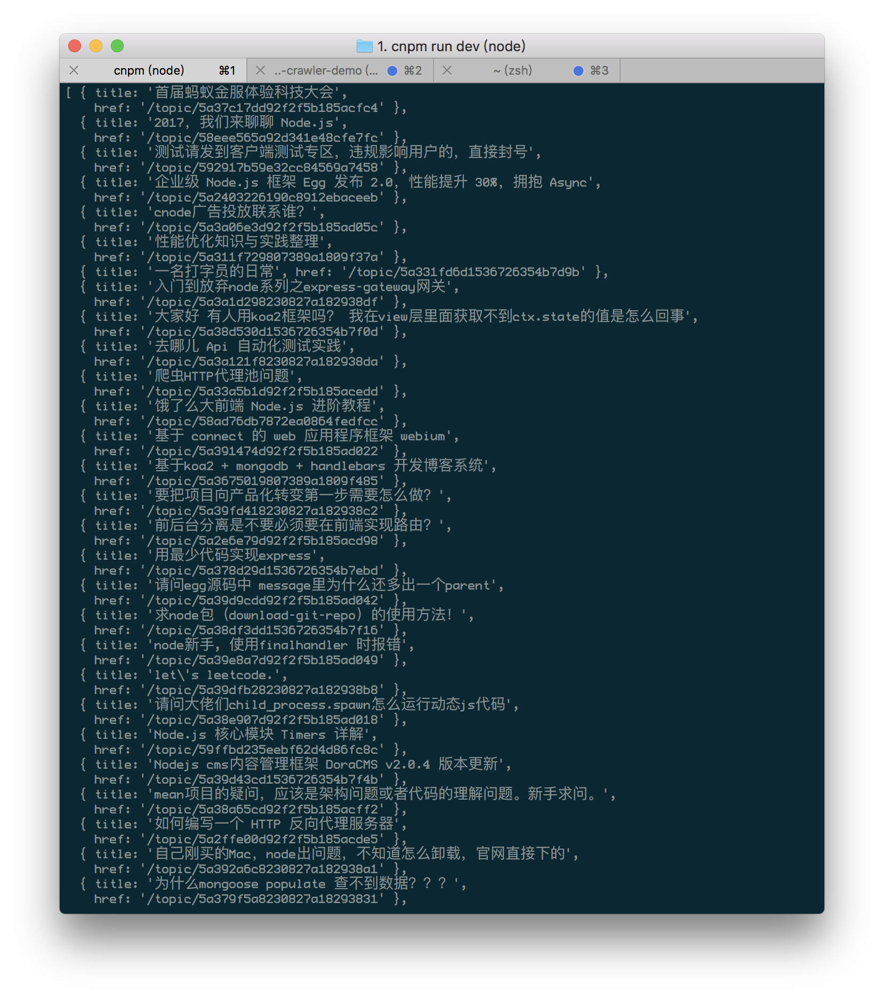
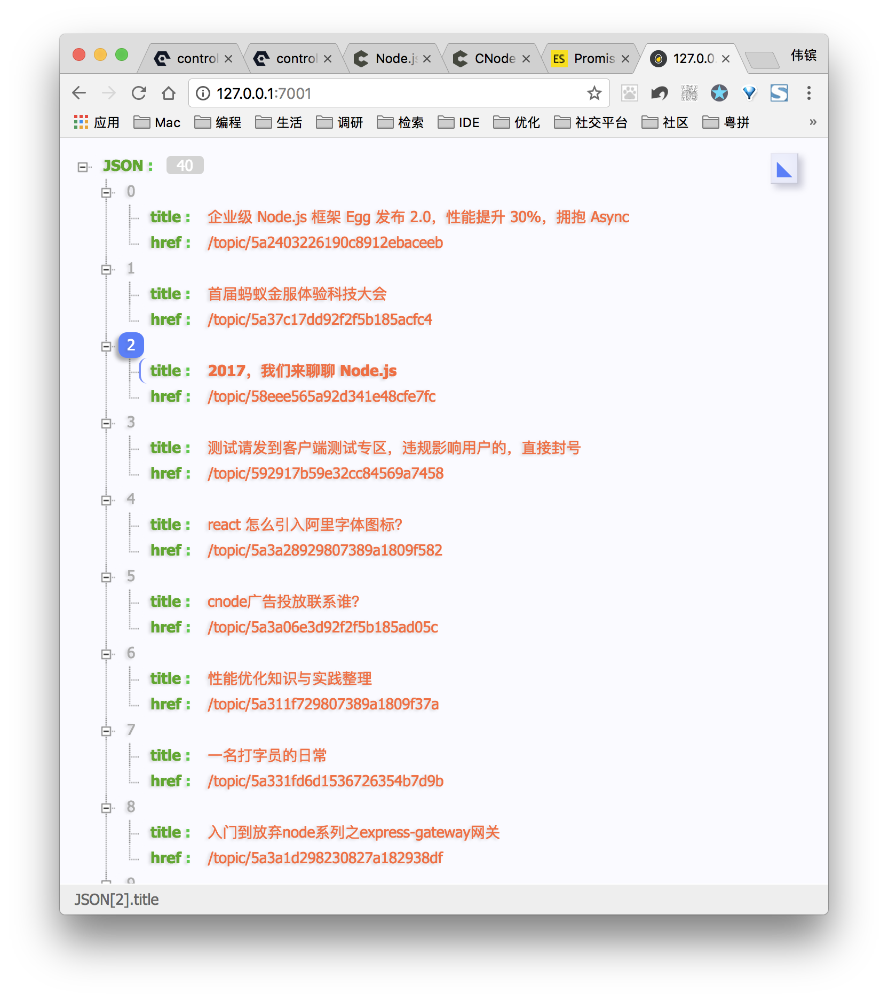

# 从0搭建nodejs

###### 作者
noone

###### 日期
2017-12-14

###### 标签
 nodejs , superagent , cheerio , Promise , resolve

---

<!-- @import "[TOC]" {cmd="toc" depthFrom=2 depthTo=5 orderedList=false} -->
<!-- code_chunk_output -->

* [涉及的插件](#涉及的插件)
* [步骤](#步骤)
* [界面展示](#界面展示)
* [demo](#demo)
* [参考资料](#参考资料)

<!-- /code_chunk_output -->


## 涉及的插件
- `superagent`([http://visionmedia.github.io/superagent/](http://visionmedia.github.io/superagent/))
- `cheerio`([https://github.com/cheeriojs/cheerio ](https://github.com/cheeriojs/cheerio ))
## 步骤
- 初始化项目
```
$ egg-init web-crawler-demo --type=simple
$ cd web-crawler-demo
$ npm i
$ npm run dev
```
访问`127.0.0.1:7001`，成功

- 引入 `superagent` 和 `cheerio`模块
```
$ npm i --save superagent
$ npm i --save cheerio
```
- 编写home.js
```javascript
'use strict';

const Controller = require('egg').Controller;
const cheerio = require('cheerio');
const superagent = require('superagent');
class HomeController extends Controller {
  async index() {
      superagent.get('https://cnodejs.org/').end(
          (err, sres) => {
              if (err) {
                  return err;
              }
              // sres.text 里面存储着网页的 html 内容，将它传给 cheerio.load 之后
              // 就可以得到一个实现了 jquery 接口的变量，我们习惯性地将它命名为 `$`
              var $ = cheerio.load(sres.text);
              var items = [];
              $('#topic_list .topic_title').each(
                  (idx, element) => {
                      var $element = $(element);
                      items.push({
                          title: $element.attr('title'),
                          href: $element.attr('href')
                      });
                  }
              );
              console.log(items);
          }
      );
    this.ctx.body = 'hi, egg';
  }
}

module.exports = HomeController;
```
此时，界面显示`hi, egg`,控制台打印内容如下



成功爬取

## 界面展示
此时想要将结果渲染到页面，初步想法在superagent方法之前声明`items`，返回`this.ctx.body = items;`

然而，因为异步问题，输出结果为`[]`;

此时，用ES6的promise方法
```javascript
'use strict';

const Controller = require('egg').Controller;
const cheerio = require('cheerio');
const superagent = require('superagent');

class HomeController extends Controller {
    async index() {
        var res = [];
        await new Promise(resolve => {
            superagent.get('https://cnodejs.org/').end(
                (err, sres) => {
                    if (err) {
                        return err;
                    }
                    // sres.text 里面存储着网页的 html 内容，将它传给 cheerio.load 之后
                    // 就可以得到一个实现了 jquery 接口的变量，我们习惯性地将它命名为 `$`
                    var $ = cheerio.load(sres.text);
                    var items = [];
                    $('#topic_list .topic_title').each(
                        (idx, element) => {
                            var $element = $(element);
                            items.push({
                                title: $element.attr('title'),
                                href: $element.attr('href')
                            });
                        }
                    );
                    // 调用成功后，将items作为参数传递出去
                    resolve(items);
                }
            );
        }).then(value => {
            res = value;
        });
        this.ctx.body = res;
    }
}

module.exports = HomeController;

```
界面输出如下：


## demo
[点此查看demo](https://github.com/BayeNoone/node-example/tree/master/web-crawler-demo)
## 参考资料
[《使用 superagent 与 cheerio 完成简单爬虫》](https://github.com/alsotang/node-lessons/tree/master/lesson3)

 ---

 [返回上级目录README.md](../README.md)
