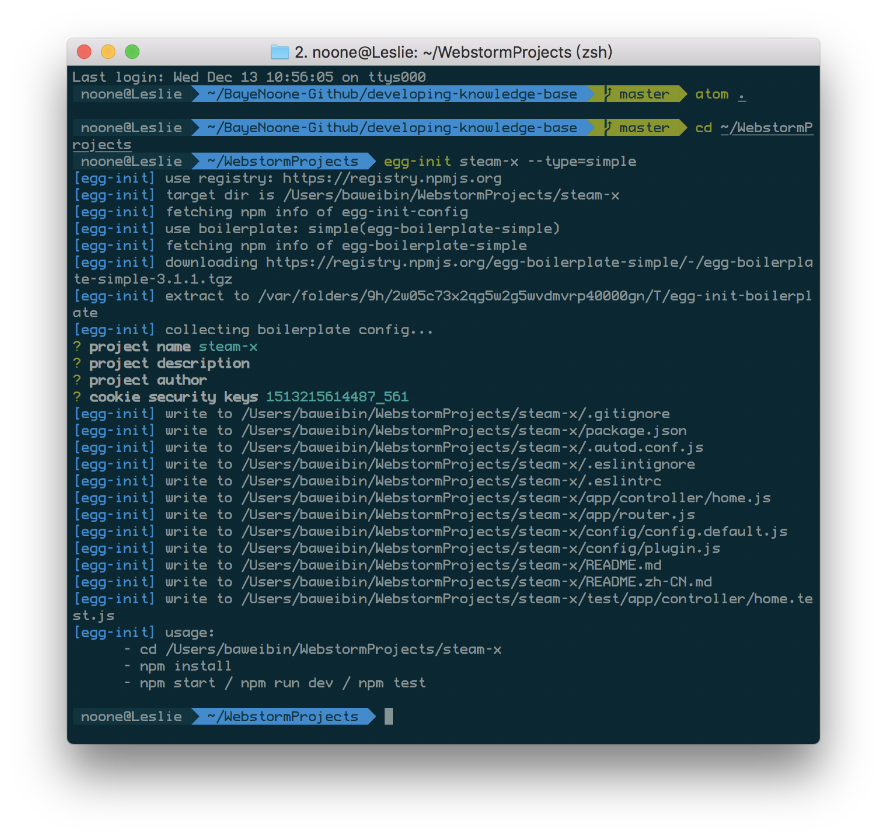
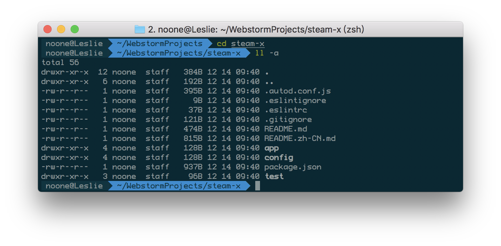
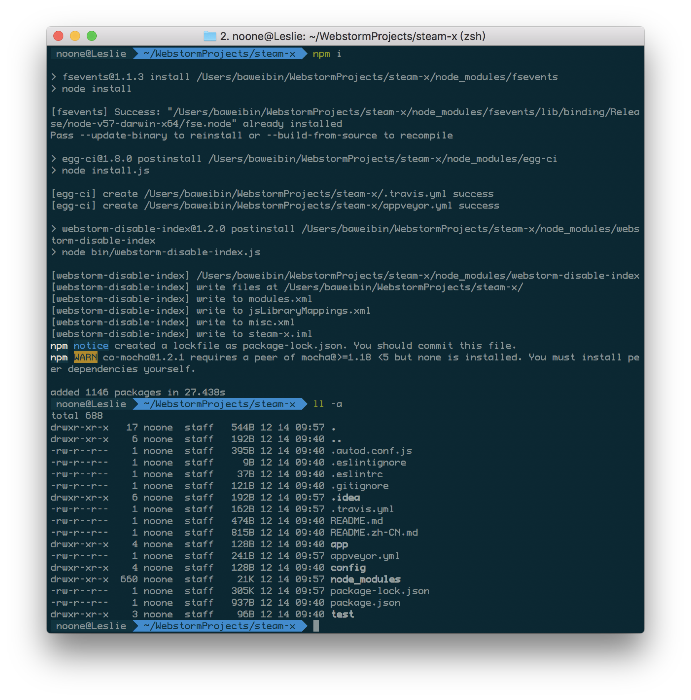
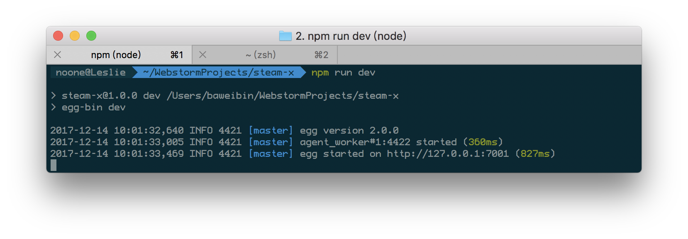
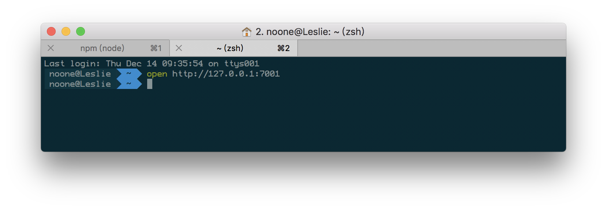
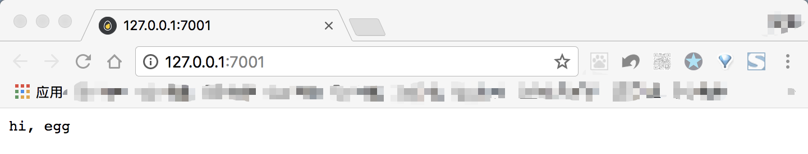
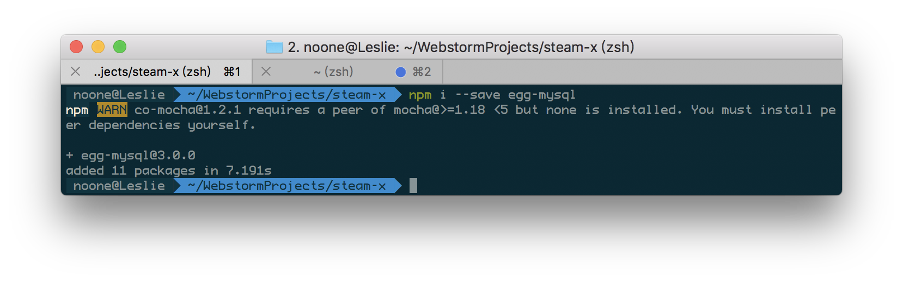

# 从0搭建nodejs

###### 作者
noone

###### 日期
2017-12-14

###### 标签
 nodejs

---

<!-- @import "[TOC]" {cmd="toc" depthFrom=2 depthTo=5 orderedList=false} -->
<!-- code_chunk_output -->

* [demo地址](#demo地址)
* [egg初始化](#egg初始化)
* [配置mysql数据库](#配置mysql数据库)
	* [单数据源](#单数据源)
	* [多数据源](#多数据源)
	* [调用demo](#调用demo)
	* [CRUD 语句](#crud-语句)
* [Service层调用](#service层调用)
	* [调用demo](#调用demo-1)
* [Controller](#controller)
	* [自定义Controller基类](#自定义controller基类)
	* [继承](#继承)
* [router](#router)

<!-- /code_chunk_output -->
## demo地址
[example-init](https://github.com/BayeNoone/node-example/tree/master/example-init)
## egg初始化

- 全局安装egg初始化包egg-init

```npm
$ npm i egg-init -g
```

- 初始化项目

```npm
$ egg-init steam-x --type=simple
```

如图，按提示操作即可


- 安装插件

```
$ cd steam-x
```
目录结构如下：


```
$ npm i
```
目录结构如下：


- 启动
```
$ npm run dev
$ open http://127.0.0.1/7001
```







## 配置mysql数据库
- 安装egg-mysql插件
```
$ npm i --save egg-mysql
```


- 开启插件
```javascript
// config/plugin.js
exports.mysql = {
  enable: true,
  package: 'egg-mysql',
};
```
- 在 config/config.${env}.js 配置各个环境的数据库连接信息。
### 单数据源
```javascript
// config/config.local.js
exports.mysql = {
  // 单数据库信息配置
  client: {
    // host
    host: 'mysql.com',
    // 端口号
    port: '3306',
    // 用户名
    user: 'test_user',
    // 密码
    password: 'test_password',
    // 数据库名
    database: 'test',
  },
  // 是否加载到 app 上，默认开启
  app: true,
  // 是否加载到 agent 上，默认关闭
  agent: false,
};
```
使用方式
```javascript
await app.mysql.query(sql, values); // 单实例可以直接通过 app.mysql 访问
```
### 多数据源

```javascript
exports.mysql = {
  clients: {
    // clientId, 获取client实例，需要通过 app.mysql.get('clientId') 获取
    db1: {
      // host
      host: 'mysql.com',
      // 端口号
      port: '3306',
      // 用户名
      user: 'test_user',
      // 密码
      password: 'test_password',
      // 数据库名
      database: 'test',
    },
    db2: {
      // host
      host: 'mysql2.com',
      // 端口号
      port: '3307',
      // 用户名
      user: 'test_user',
      // 密码
      password: 'test_password',
      // 数据库名
      database: 'test',
    },
    // ...
  },
  // 所有数据库配置的默认值
  default: {

  },

  // 是否加载到 app 上，默认开启
  app: true,
  // 是否加载到 agent 上，默认关闭
  agent: false,
};
```
使用方式
```javascript
const client1 = app.mysql.get('db1');
await client1.query(sql, values);

const client2 = app.mysql.get('db2');
await client2.query(sql, values);
```

### 调用demo
```javascript
'use strict'
// app/service/user.js
const Service = require('egg').Service;
class UserService extends Service{
    async find(uid){
        const user = await this.app.mysql.get('users',{id:uid});
        console.log(user);
        return {user};
    }
}
module.exports = UserService;

// app/controller/user.js
'use strict'

const Controller = require('egg').Controller;
class UserController extends Controller{
    async info(){
        const userId = this.ctx.params.id;
        const userInfo = await this.ctx.service.user.find(userId);
        this.ctx.body = userInfo;
    }
}
module.exports = UserController;

//app/router.js
'use strict';

module.exports = app => {
  const { router, controller } = app;
  router.get('/user/:id',controller.user.info);
};
```
### CRUD 语句
[阅读egg官方文档](https://eggjs.org/zh-cn/tutorials/mysql.html#)

## Service层调用

- Service 文件必须放在 `app/service` 目录，可以支持多级目录，访问的时候可以通过目录名级联访问。
```javascript
app/service/biz/user.js => ctx.service.biz.user
app/service/sync_user.js => ctx.service.syncUser
app/service/HackerNews.js => ctx.service.hackerNews
```
- 一个 Service 文件只能包含一个类， 这个类需要通过 `module.exports` 的方式返回。

- Service 需要通过 Class 的方式定义，父类必须是 `egg.Service`。

- Service 不是单例，是 请求级别 的对象，框架在每次请求中首次访问 `ctx.service.xx` 时延迟实例化，所以 Service 中可以通过 `this.ctx` 获取到当前请求的上下文。

### 调用demo
```javascript
// app/router.js
module.exports = app => {
  app.router.get('/user/:id', app.controller.user.info);
};

// app/controller/user.js
const Controller = require('egg').Controller;
class UserController extends Controller {
  async info() {
    const userId = ctx.params.id;
    const userInfo = await ctx.service.user.find(userId);
    ctx.body = userInfo;
  }
}
module.exports = UserController;

// app/service/user.js
const Service = require('egg').Service;
class UserService extends Service {
  // 默认不需要提供构造函数。
  // constructor(ctx) {
  //   super(ctx); 如果需要在构造函数做一些处理，一定要有这句话，才能保证后面 `this.ctx`的使用。
  //   // 就可以直接通过 this.ctx 获取 ctx 了
  //   // 还可以直接通过 this.app 获取 app 了
  // }
  async find(uid) {
    // 假如 我们拿到用户 id 从数据库获取用户详细信息
    const user = await this.ctx.db.query('select * from user where uid = ?', uid);

    // 假定这里还有一些复杂的计算，然后返回需要的信息。
    const picture = await this.getPicture(uid);

    return {
      name: user.user_name,
      age: user.age,
      picture,
    };
  }

  async getPicture(uid) {
    const result = await this.ctx.curl(`http://photoserver/uid=${uid}`, { dataType: 'json' });
    return result.data;
  }
}
module.exports = UserService;
```
## Controller
### 自定义Controller基类
```javascript
// app/core/base_controller.js
const { Controller } = require('egg');
class BaseController extends Controller {
  get user() {
    return this.ctx.session.user;
  }

  success(data) {
    this.ctx.body = {
      success: true,
      data,
    };
  }

  notFound(msg) {
    msg = msg || 'not found';
    this.ctx.throw(404, msg);
  }
}
module.exports = BaseController;
```
### 继承
```javascript
//app/controller/post.js
const Controller = require('../core/base_controller');
class PostController extends Controller {
  async list() {
    const posts = await this.service.listByUser(this.user);
    this.success(posts);
  }
}
```

## router
多路由控制
```javascript
// app/router.js
module.exports = app => {
  require('./router/news')(app);
  require('./router/admin')(app);
};

// app/router/news.js
module.exports = app => {
  app.router.get('/news/list', app.controller.news.list);
  app.router.get('/news/detail', app.controller.news.detail);
};

// app/router/admin.js
module.exports = app => {
  app.router.get('/admin/user', app.controller.admin.user);
  app.router.get('/admin/log', app.controller.admin.log);
};
```

## 跨域访问配置egg-cors
```
$ npm i egg-cors --save
```
```javascript
// config/plugin.js
exports.cors={
  enable:true,
  package:'egg-cors'
};
```
添加允许访问的域名信息
```javascript
// config/config.default.js
'use strict';

module.exports = appInfo => {
  const config = exports = {};

  // use for cookie sign key, should change to your own and keep security
  config.keys = appInfo.name + '_1514378190879_193';

  // add your config here
  config.middleware = [];
  config.security={
    domainWhiteList:['127.0.0.1:8080']
  };
  return config;
};
```
---
[返回根目录README.md](../README.md)
