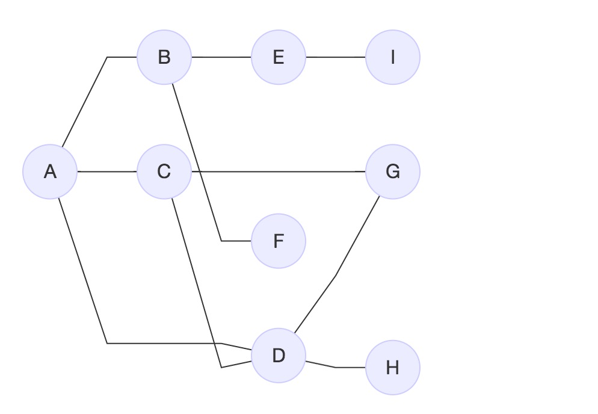

# JavaScript 图

###### 作者

noone

###### 日期

2017-11-14

###### 标签

javascript , 图

--------------------------------------------------------------------------------


<!-- @import "[TOC]" {cmd="toc" depthFrom=2 depthTo=5 orderedList=false} -->
<!-- code_chunk_output -->

* [图的相关术语](#图的相关术语)
* [图的表示](#图的表示)
	* [邻接矩阵](#邻接矩阵)
	* [领接表](#领接表)
	* [关联矩阵](#关联矩阵)
* [图的遍历](#图的遍历)
	* [广度优先遍历](#广度优先遍历)
		* [使用BFS寻找最短路径](#使用bfs寻找最短路径)
	* [深度优先遍历](#深度优先遍历)
		* [改进的DFS](#改进的dfs)

<!-- /code_chunk_output -->



## 图的相关术语
一个图`G = ( V , E )`由以下元素组成
- V 一**组**顶点
- E 一组边，连接V中的顶点
- 相邻顶点
  > 一条线连接在一起的两个顶点

- 顶点的度
  > 一个顶点的度是其相邻顶点的数量

- 路径
  > V~1~,V~2~,...,V~k~的一个联系序列，其中，V~i~和V~i+1~是相邻的。

- 简单路径
  - 要求不包含重复的顶点。如：A D G；
  - 环也是一个简单路径。如：A D C A；

- 无环
- 连通
  > 如果图中每两个顶点都存在路径
- 有向图
- 无向图
- 强连通的
  > 如果图中两个节点在双向上都存在路径
- 未加权的
- 加权的
  > 边被赋予权值

## 图的表示

### 邻接矩阵

每个节点都和一个整数相关联，该整数将作为数组的索引。
用一个二维数组表示，如果索引为i的节点和索引为j的节点相邻，则array[i][j] === 1,反之array[i][j] === 0;

|  -  | A   | B   | C   | D   | E   | F   | G   | H   | I   |
| --- | --- | --- | --- | --- | --- | --- | --- | --- | --- |
| A   | 0   | 1   | 1   | 1   | 0   | 0   | 0   | 0   | 0   |
| B   | 1   | 0   | 0   | 0   | 1   | 1   | 0   | 0   | 0   |
| C   | 1   | 0   | 0   | 1   | 0   | 0   | 1   | 0   | 0   |
| D   | 1   | 0   | 1   | 0   | 0   | 0   | 1   | 1   | 0   |
| E   | 0   | 0   | 0   | 0   | 0   | 0   | 0   | 0   | 1   |
| F   | 0   | 1   | 0   | 0   | 0   | 0   | 0   | 0   | 0   |
| G   | 0   | 0   | 1   | 1   | 0   | 0   | 0   | 0   | 0   |
| H   | 0   | 0   | 0   | 1   | 0   | 0   | 0   | 0   | 0   |
| I   | 0   | 0   | 0   | 0   | 1   | 0   | 0   | 0   | 0   |


> 如果为稀疏图，则占内存，浪费大量空间存储0；

### 领接表
由图中每个顶点的相邻顶点列表所组成。如需查找两个顶点是否相邻，比较快；
```
A B C D
B A E F
C A D G
D A C G H
E B I
F B
G C D
H D
I E
```
### 关联矩阵
行表示顶点，列表示边
如果顶点v是边e的入射点，则array[v][e]===1,反之array[v][e]===0；
关联矩阵通常用在边的数量比顶点多的情况下；

## 图的遍历

| 算法         | 数据结构 | 描述                                                                 |
| ------------ | -------- | -------------------------------------------------------------------- |
| 深度优先遍历 | 栈       | 通过将顶点存入栈中，顶点是沿着路径被探索的，存在新的相邻顶点就去访问 |
| 广度优先遍历 | 队列         |  通过将顶点存入队列中，最先入队的顶点先被探索                                                                    |

> 当要标注访问过的顶点时，用三种颜色标记状态
> - 白色：该顶点还没有被访问过。
> - 灰色：该顶点被访问过，但并未被探索过。
> - 黑色：该顶点被访问且完全探索过。

### 广度优先遍历

从一个指定的顶点开始遍历图，先访问其所有的相邻点，就像访问图的一层。
- 创建一个队列Q
- 将顶点V标注为被发现的（灰色），并将V入列Q
- 如果V非空
  - 将u从Q中出队列；
  - 将标注u为被发现的（灰色）；
  - 将u所有未被访问的邻点（白色）入列；
  - 将u标记为已探索（黑色）；

> 具体实现[点此查看](../../algorithms/graph/广度优先探索算法.js)
#### 使用BFS寻找最短路径

给定一个图G和源顶点v，找出对于每个顶点u，u和v之间的最短路径的距离（以边的数量计算）。

对于给定的顶点v，广度优先算法会访问所有与其距离为1的顶点，接着是2，以此类推；

BFS返回信息：
- 从v到u的距离 d[u]
- 前溯点pred[u]，用来推导出从v到其他每个顶点u的最短路径

shortestPath利用回溯的思维，实现最短路径。

> 具体实现[点此查看](../../algorithms/graph/改进的广度优先探索算法.js)

当顶点为1时，输出结果如下：
```
{ distances: [ A: 1, B: 0, C: 2, D: 2, E: 1, F: 1, G: 3, H: 3, I: 2 ],
  predecessors:
   [ A: 'B',
     B: null,
     C: 'A',
     D: 'A',
     E: 'B',
     F: 'B',
     G: 'C',
     H: 'D',
     I: 'E' ] }
B-A
B-A-C
B-A-D
B-E
B-F
B-A-C-G
B-A-D-H
B-E-I
```
### 深度优先遍历
从第一个指定的顶点开始遍历图，沿着路径直到这条路径的最后一个顶点被访问了，接着按着原路回退，并探索下一条路径。
> 具体实现[点此查看](../../algorithms/graph/深度优先探索算法.js)

#### 改进的DFS
对于给定的图G，我们希望遍历图G的所有节点，构建“森林”(**有根树**的一个集合)以及一组源顶点(根)，并输出两个数组：发现时间和探索完成时间
> 具体实现[点此查看](../../algorithms/graph/改进的深度优先探索算法.js)

--------------------------------------------------------------------------------

[返回上级目录README.md](../README.md)
